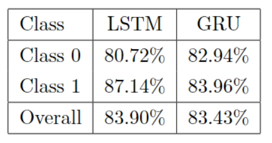
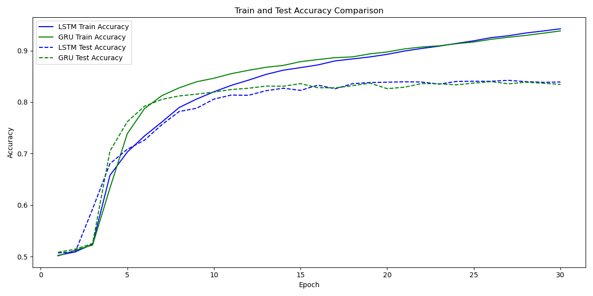
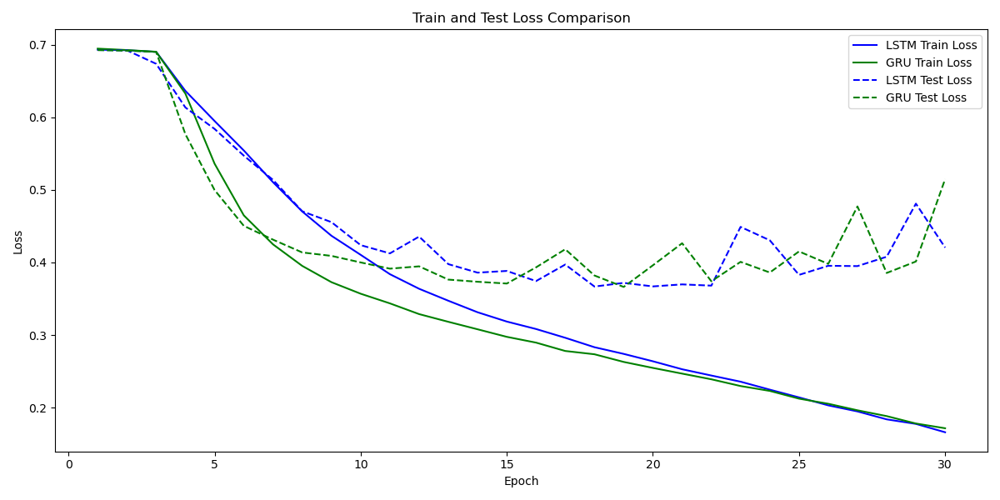
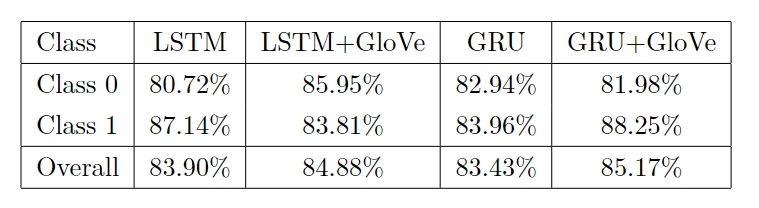

#### Accuracy

#### Loss

#### 中间数据

**LSTM：**

LSTM Epoch 1/30 Train Loss: 0.6932, Train Accuracy: 0.5023, Test Loss: 0.6927, Test Accuracy: 0.5074

LSTM Epoch 2/30 Train Loss: 0.6924, Train Accuracy: 0.5094, Test Loss: 0.6923, Test Accuracy: 0.5090

LSTM Epoch 3/30 Train Loss: 0.6902, Train Accuracy: 0.5242, Test Loss: 0.6737, Test Accuracy: 0.5926

LSTM Epoch 4/30 Train Loss: 0.6365, Train Accuracy: 0.6578, Test Loss: 0.6136, Test Accuracy: 0.6805

LSTM Epoch 5/30 Train Loss: 0.5949, Train Accuracy: 0.7029, Test Loss: 0.5840, Test Accuracy: 0.7084

LSTM Epoch 6/30 Train Loss: 0.5543, Train Accuracy: 0.7344, Test Loss: 0.5472, Test Accuracy: 0.7263

LSTM Epoch 7/30 Train Loss: 0.5105, Train Accuracy: 0.7614, Test Loss: 0.5138, Test Accuracy: 0.7563

LSTM Epoch 8/30 Train Loss: 0.4702, Train Accuracy: 0.7895, Test Loss: 0.4705, Test Accuracy: 0.7818

LSTM Epoch 9/30 Train Loss: 0.4368, Train Accuracy: 0.8059, Test Loss: 0.4556, Test Accuracy: 0.7880

LSTM Epoch 10/30 Train Loss: 0.4105, Train Accuracy: 0.8200, Test Loss: 0.4238, Test Accuracy: 0.8058

LSTM Epoch 11/30 Train Loss: 0.3838, Train Accuracy: 0.8324, Test Loss: 0.4125, Test Accuracy: 0.8137

LSTM Epoch 12/30 Train Loss: 0.3637, Train Accuracy: 0.8426, Test Loss: 0.4357, Test Accuracy: 0.8132

LSTM Epoch 13/30 Train Loss: 0.3473, Train Accuracy: 0.8537, Test Loss: 0.3977, Test Accuracy: 0.8220

LSTM Epoch 14/30 Train Loss: 0.3314, Train Accuracy: 0.8619, Test Loss: 0.3860, Test Accuracy: 0.8269

LSTM Epoch 15/30 Train Loss: 0.3186, Train Accuracy: 0.8669, Test Loss: 0.3883, Test Accuracy: 0.8228

LSTM Epoch 16/30 Train Loss: 0.3083, Train Accuracy: 0.8722, Test Loss: 0.3744, Test Accuracy: 0.8328

LSTM Epoch 17/30 Train Loss: 0.2962, Train Accuracy: 0.8800, Test Loss: 0.3971, Test Accuracy: 0.8258

LSTM Epoch 18/30 Train Loss: 0.2832, Train Accuracy: 0.8838, Test Loss: 0.3668, Test Accuracy: 0.8358

LSTM Epoch 19/30 Train Loss: 0.2740, Train Accuracy: 0.8877, Test Loss: 0.3719, Test Accuracy: 0.8380

LSTM Epoch 20/30 Train Loss: 0.2639, Train Accuracy: 0.8927, Test Loss: 0.3670, Test Accuracy: 0.8386

LSTM Epoch 21/30 Train Loss: 0.2529, Train Accuracy: 0.8991, Test Loss: 0.3698, Test Accuracy: 0.8394

LSTM Epoch 22/30 Train Loss: 0.2442, Train Accuracy: 0.9042, Test Loss: 0.3681, Test Accuracy: 0.8389

LSTM Epoch 23/30 Train Loss: 0.2357, Train Accuracy: 0.9086, Test Loss: 0.4490, Test Accuracy: 0.8349

LSTM Epoch 24/30 Train Loss: 0.2248, Train Accuracy: 0.9139, Test Loss: 0.4306, Test Accuracy: 0.8402

LSTM Epoch 25/30 Train Loss: 0.2141, Train Accuracy: 0.9190, Test Loss: 0.3829, Test Accuracy: 0.8405

LSTM Epoch 26/30 Train Loss: 0.2031, Train Accuracy: 0.9251, Test Loss: 0.3954, Test Accuracy: 0.8404

LSTM Epoch 27/30 Train Loss: 0.1948, Train Accuracy: 0.9288, Test Loss: 0.3950, Test Accuracy: 0.8423

LSTM Epoch 28/30 Train Loss: 0.1838, Train Accuracy: 0.9341, Test Loss: 0.4079, Test Accuracy: 0.8397

LSTM Epoch 29/30 Train Loss: 0.1776, Train Accuracy: 0.9380, Test Loss: 0.4810, Test Accuracy: 0.8384

LSTM Epoch 30/30 Train Loss: 0.1661, Train Accuracy: 0.9423, Test Loss: 0.4206, Test Accuracy: 0.8390

**GRU：**

GRU Epoch 1/30 Train Loss: 0.6946, Train Accuracy: 0.5015, Test Loss: 0.6926, Test Accuracy: 0.5084

GRU Epoch 2/30 Train Loss: 0.6927, Train Accuracy: 0.5124, Test Loss: 0.6918, Test Accuracy: 0.5146

GRU Epoch 3/30 Train Loss: 0.6903, Train Accuracy: 0.5226, Test Loss: 0.6901, Test Accuracy: 0.5256

GRU Epoch 4/30 Train Loss: 0.6327, Train Accuracy: 0.6330, Test Loss: 0.5768, Test Accuracy: 0.7048

GRU Epoch 5/30 Train Loss: 0.5361, Train Accuracy: 0.7386, Test Loss: 0.4997, Test Accuracy: 0.7618

GRU Epoch 6/30 Train Loss: 0.4649, Train Accuracy: 0.7875, Test Loss: 0.4505, Test Accuracy: 0.7921

GRU Epoch 7/30 Train Loss: 0.4249, Train Accuracy: 0.8125, Test Loss: 0.4314, Test Accuracy: 0.8053

GRU Epoch 8/30 Train Loss: 0.3953, Train Accuracy: 0.8277, Test Loss: 0.4138, Test Accuracy: 0.8119

GRU Epoch 9/30 Train Loss: 0.3728, Train Accuracy: 0.8394, Test Loss: 0.4091, Test Accuracy: 0.8154

GRU Epoch 10/30 Train Loss: 0.3569, Train Accuracy: 0.8463, Test Loss: 0.4000, Test Accuracy: 0.8195

GRU Epoch 11/30 Train Loss: 0.3436, Train Accuracy: 0.8551, Test Loss: 0.3915, Test Accuracy: 0.8244

GRU Epoch 12/30 Train Loss: 0.3288, Train Accuracy: 0.8617, Test Loss: 0.3947, Test Accuracy: 0.8268

GRU Epoch 13/30 Train Loss: 0.3182, Train Accuracy: 0.8675, Test Loss: 0.3764, Test Accuracy: 0.8311

GRU Epoch 14/30 Train Loss: 0.3079, Train Accuracy: 0.8712, Test Loss: 0.3734, Test Accuracy: 0.8308

GRU Epoch 15/30 Train Loss: 0.2975, Train Accuracy: 0.8785, Test Loss: 0.3710, Test Accuracy: 0.8358

GRU Epoch 16/30 Train Loss: 0.2896, Train Accuracy: 0.8826, Test Loss: 0.3932, Test Accuracy: 0.8279

GRU Epoch 17/30 Train Loss: 0.2780, Train Accuracy: 0.8863, Test Loss: 0.4182, Test Accuracy: 0.8276

GRU Epoch 18/30 Train Loss: 0.2735, Train Accuracy: 0.8878, Test Loss: 0.3820, Test Accuracy: 0.8318

GRU Epoch 19/30 Train Loss: 0.2630, Train Accuracy: 0.8936, Test Loss: 0.3663, Test Accuracy: 0.8369

GRU Epoch 20/30 Train Loss: 0.2547, Train Accuracy: 0.8973, Test Loss: 0.3961, Test Accuracy: 0.8260

GRU Epoch 21/30 Train Loss: 0.2469, Train Accuracy: 0.9032, Test Loss: 0.4265, Test Accuracy: 0.8289

GRU Epoch 22/30 Train Loss: 0.2390, Train Accuracy: 0.9070, Test Loss: 0.3741, Test Accuracy: 0.8361

GRU Epoch 23/30 Train Loss: 0.2297, Train Accuracy: 0.9092, Test Loss: 0.4008, Test Accuracy: 0.8356

GRU Epoch 24/30 Train Loss: 0.2230, Train Accuracy: 0.9133, Test Loss: 0.3862, Test Accuracy: 0.8335

GRU Epoch 25/30 Train Loss: 0.2124, Train Accuracy: 0.9166, Test Loss: 0.4152, Test Accuracy: 0.8369

GRU Epoch 26/30 Train Loss: 0.2053, Train Accuracy: 0.9219, Test Loss: 0.3980, Test Accuracy: 0.8398

GRU Epoch 27/30 Train Loss: 0.1963, Train Accuracy: 0.9259, Test Loss: 0.4772, Test Accuracy: 0.8355

GRU Epoch 28/30 Train Loss: 0.1883, Train Accuracy: 0.9295, Test Loss: 0.3855, Test Accuracy: 0.8386

GRU Epoch 29/30 Train Loss: 0.1781, Train Accuracy: 0.9337, Test Loss: 0.4013, Test Accuracy: 0.8366

GRU Epoch 30/30 Train Loss: 0.1716, Train Accuracy: 0.9382, Test Loss: 0.5149, Test Accuracy: 0.8343

### 使用预训练的GloVe词向量

#### Accuracy

#### 中间数据

**LSTM**

LSTM Epoch 1/30 Train Loss: 0.6415, Train Accuracy: 0.6079, Test Loss: 0.5285, Test Accuracy: 0.7440

LSTM Epoch 2/30 Train Loss: 0.4948, Train Accuracy: 0.7689, Test Loss: 0.4906, Test Accuracy: 0.7743

LSTM Epoch 3/30 Train Loss: 0.4669, Train Accuracy: 0.7842, Test Loss: 0.4683, Test Accuracy: 0.7850

LSTM Epoch 4/30 Train Loss: 0.4514, Train Accuracy: 0.7952, Test Loss: 0.4412, Test Accuracy: 0.7947

LSTM Epoch 5/30 Train Loss: 0.4421, Train Accuracy: 0.7994, Test Loss: 0.4361, Test Accuracy: 0.8005

LSTM Epoch 6/30 Train Loss: 0.4246, Train Accuracy: 0.8072, Test Loss: 0.4122, Test Accuracy: 0.8125

LSTM Epoch 7/30 Train Loss: 0.4111, Train Accuracy: 0.8193, Test Loss: 0.4014, Test Accuracy: 0.8173

LSTM Epoch 8/30 Train Loss: 0.3998, Train Accuracy: 0.8244, Test Loss: 0.3958, Test Accuracy: 0.8258

LSTM Epoch 9/30 Train Loss: 0.3902, Train Accuracy: 0.8286, Test Loss: 0.4170, Test Accuracy: 0.8250

LSTM Epoch 10/30 Train Loss: 0.3799, Train Accuracy: 0.8334, Test Loss: 0.4077, Test Accuracy: 0.8221

LSTM Epoch 11/30 Train Loss: 0.3701, Train Accuracy: 0.8421, Test Loss: 0.3763, Test Accuracy: 0.8336

LSTM Epoch 12/30 Train Loss: 0.3650, Train Accuracy: 0.8416, Test Loss: 0.3854, Test Accuracy: 0.8302

LSTM Epoch 13/30 Train Loss: 0.3591, Train Accuracy: 0.8443, Test Loss: 0.4077, Test Accuracy: 0.8167

LSTM Epoch 14/30 Train Loss: 0.3513, Train Accuracy: 0.8466, Test Loss: 0.3737, Test Accuracy: 0.8352

LSTM Epoch 15/30 Train Loss: 0.3477, Train Accuracy: 0.8514, Test Loss: 0.3732, Test Accuracy: 0.8368

LSTM Epoch 16/30 Train Loss: 0.3440, Train Accuracy: 0.8515, Test Loss: 0.3570, Test Accuracy: 0.8431

LSTM Epoch 17/30 Train Loss: 0.3399, Train Accuracy: 0.8544, Test Loss: 0.4239, Test Accuracy: 0.8166

LSTM Epoch 18/30 Train Loss: 0.3313, Train Accuracy: 0.8594, Test Loss: 0.3545, Test Accuracy: 0.8427

LSTM Epoch 19/30 Train Loss: 0.3320, Train Accuracy: 0.8601, Test Loss: 0.3862, Test Accuracy: 0.8205

LSTM Epoch 20/30 Train Loss: 0.3259, Train Accuracy: 0.8625, Test Loss: 0.3805, Test Accuracy: 0.8285

LSTM Epoch 21/30 Train Loss: 0.3180, Train Accuracy: 0.8660, Test Loss: 0.3655, Test Accuracy: 0.8353

LSTM Epoch 22/30 Train Loss: 0.3175, Train Accuracy: 0.8671, Test Loss: 0.4061, Test Accuracy: 0.8134

LSTM Epoch 23/30 Train Loss: 0.3094, Train Accuracy: 0.8691, Test Loss: 0.3539, Test Accuracy: 0.8438

LSTM Epoch 24/30 Train Loss: 0.3094, Train Accuracy: 0.8702, Test Loss: 0.4025, Test Accuracy: 0.8153

LSTM Epoch 25/30 Train Loss: 0.3009, Train Accuracy: 0.8758, Test Loss: 0.3578, Test Accuracy: 0.8394

LSTM Epoch 26/30 Train Loss: 0.3009, Train Accuracy: 0.8727, Test Loss: 0.3551, Test Accuracy: 0.8471

LSTM Epoch 27/30 Train Loss: 0.2983, Train Accuracy: 0.8771, Test Loss: 0.3525, Test Accuracy: 0.8469

LSTM Epoch 28/30 Train Loss: 0.2929, Train Accuracy: 0.8794, Test Loss: 0.3615, Test Accuracy: 0.8420

LSTM Epoch 29/30 Train Loss: 0.2864, Train Accuracy: 0.8810, Test Loss: 0.3509, Test Accuracy: 0.8460

LSTM Epoch 30/30 Train Loss: 0.2864, Train Accuracy: 0.8818, Test Loss: 0.3563, Test Accuracy: 0.8488

**GRU**

GRU Epoch 1/30 Train Loss: 0.6310, Train Accuracy: 0.6105, Test Loss: 0.4878, Test Accuracy: 0.7713

GRU Epoch 2/30 Train Loss: 0.4746, Train Accuracy: 0.7790, Test Loss: 0.4466, Test Accuracy: 0.7926

GRU Epoch 3/30 Train Loss: 0.4401, Train Accuracy: 0.7978, Test Loss: 0.4316, Test Accuracy: 0.7993

GRU Epoch 4/30 Train Loss: 0.4198, Train Accuracy: 0.8095, Test Loss: 0.4018, Test Accuracy: 0.8158

GRU Epoch 5/30 Train Loss: 0.4025, Train Accuracy: 0.8194, Test Loss: 0.3915, Test Accuracy: 0.8242

GRU Epoch 6/30 Train Loss: 0.3890, Train Accuracy: 0.8290, Test Loss: 0.4147, Test Accuracy: 0.8058

GRU Epoch 7/30 Train Loss: 0.3776, Train Accuracy: 0.8344, Test Loss: 0.3956, Test Accuracy: 0.8246

GRU Epoch 8/30 Train Loss: 0.3701, Train Accuracy: 0.8372, Test Loss: 0.3672, Test Accuracy: 0.8364

GRU Epoch 9/30 Train Loss: 0.3629, Train Accuracy: 0.8431, Test Loss: 0.3754, Test Accuracy: 0.8292

GRU Epoch 10/30 Train Loss: 0.3569, Train Accuracy: 0.8456, Test Loss: 0.3580, Test Accuracy: 0.8420

GRU Epoch 11/30 Train Loss: 0.3481, Train Accuracy: 0.8498, Test Loss: 0.3569, Test Accuracy: 0.8410

GRU Epoch 12/30 Train Loss: 0.3430, Train Accuracy: 0.8521, Test Loss: 0.3720, Test Accuracy: 0.8328

GRU Epoch 13/30 Train Loss: 0.3384, Train Accuracy: 0.8536, Test Loss: 0.3484, Test Accuracy: 0.8441

GRU Epoch 14/30 Train Loss: 0.3321, Train Accuracy: 0.8576, Test Loss: 0.3507, Test Accuracy: 0.8445

GRU Epoch 15/30 Train Loss: 0.3267, Train Accuracy: 0.8608, Test Loss: 0.3488, Test Accuracy: 0.8461

GRU Epoch 16/30 Train Loss: 0.3223, Train Accuracy: 0.8619, Test Loss: 0.3438, Test Accuracy: 0.8482

GRU Epoch 17/30 Train Loss: 0.3152, Train Accuracy: 0.8678, Test Loss: 0.3437, Test Accuracy: 0.8496

GRU Epoch 18/30 Train Loss: 0.3123, Train Accuracy: 0.8685, Test Loss: 0.3451, Test Accuracy: 0.8486

GRU Epoch 19/30 Train Loss: 0.3085, Train Accuracy: 0.8702, Test Loss: 0.3470, Test Accuracy: 0.8506

GRU Epoch 20/30 Train Loss: 0.3031, Train Accuracy: 0.8726, Test Loss: 0.4216, Test Accuracy: 0.8184

GRU Epoch 21/30 Train Loss: 0.2996, Train Accuracy: 0.8743, Test Loss: 0.3488, Test Accuracy: 0.8464

GRU Epoch 22/30 Train Loss: 0.2898, Train Accuracy: 0.8783, Test Loss: 0.3539, Test Accuracy: 0.8510

GRU Epoch 23/30 Train Loss: 0.2928, Train Accuracy: 0.8774, Test Loss: 0.3436, Test Accuracy: 0.8487

GRU Epoch 24/30 Train Loss: 0.2837, Train Accuracy: 0.8804, Test Loss: 0.3479, Test Accuracy: 0.8495

GRU Epoch 25/30 Train Loss: 0.2808, Train Accuracy: 0.8834, Test Loss: 0.3398, Test Accuracy: 0.8525

GRU Epoch 26/30 Train Loss: 0.2751, Train Accuracy: 0.8872, Test Loss: 0.3821, Test Accuracy: 0.8503

GRU Epoch 27/30 Train Loss: 0.2689, Train Accuracy: 0.8897, Test Loss: 0.3786, Test Accuracy: 0.8326

GRU Epoch 28/30 Train Loss: 0.2641, Train Accuracy: 0.8913, Test Loss: 0.3675, Test Accuracy: 0.8496

GRU Epoch 29/30 Train Loss: 0.2613, Train Accuracy: 0.8931, Test Loss: 0.3845, Test Accuracy: 0.8339

GRU Epoch 30/30 Train Loss: 0.2538, Train Accuracy: 0.8968, Test Loss: 0.3571, Test Accuracy: 0.8434
