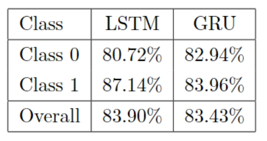
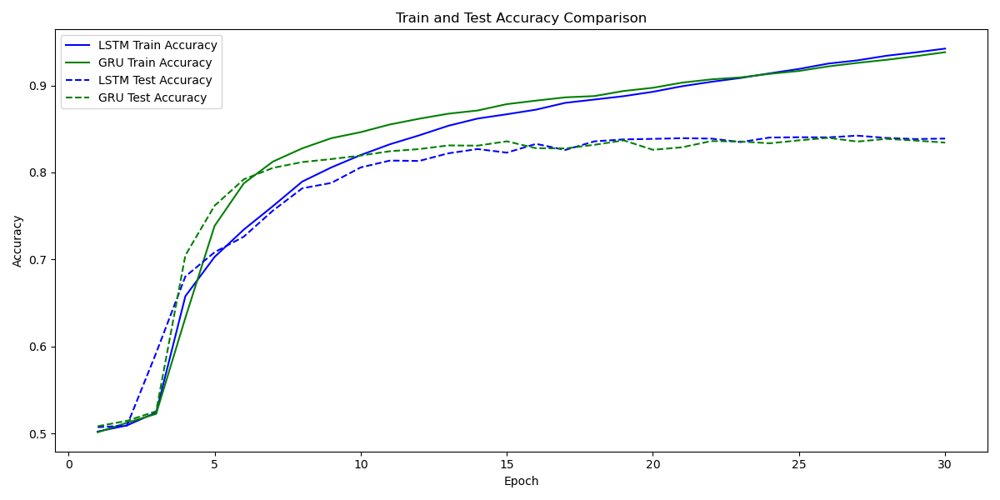

#### Accuracy

#### Loss

#### 中间数据

**LSTM：**

LSTM Epoch 1/30 Train Loss: 0.6932, Train Accuracy: 0.5023, Test Loss: 0.6927, Test Accuracy: 0.5074

LSTM Epoch 2/30 Train Loss: 0.6924, Train Accuracy: 0.5094, Test Loss: 0.6923, Test Accuracy: 0.5090

LSTM Epoch 3/30 Train Loss: 0.6902, Train Accuracy: 0.5242, Test Loss: 0.6737, Test Accuracy: 0.5926

LSTM Epoch 4/30 Train Loss: 0.6365, Train Accuracy: 0.6578, Test Loss: 0.6136, Test Accuracy: 0.6805

LSTM Epoch 5/30 Train Loss: 0.5949, Train Accuracy: 0.7029, Test Loss: 0.5840, Test Accuracy: 0.7084

LSTM Epoch 6/30 Train Loss: 0.5543, Train Accuracy: 0.7344, Test Loss: 0.5472, Test Accuracy: 0.7263

LSTM Epoch 7/30 Train Loss: 0.5105, Train Accuracy: 0.7614, Test Loss: 0.5138, Test Accuracy: 0.7563

LSTM Epoch 8/30 Train Loss: 0.4702, Train Accuracy: 0.7895, Test Loss: 0.4705, Test Accuracy: 0.7818

LSTM Epoch 9/30 Train Loss: 0.4368, Train Accuracy: 0.8059, Test Loss: 0.4556, Test Accuracy: 0.7880

LSTM Epoch 10/30 Train Loss: 0.4105, Train Accuracy: 0.8200, Test Loss: 0.4238, Test Accuracy: 0.8058

LSTM Epoch 11/30 Train Loss: 0.3838, Train Accuracy: 0.8324, Test Loss: 0.4125, Test Accuracy: 0.8137

LSTM Epoch 12/30 Train Loss: 0.3637, Train Accuracy: 0.8426, Test Loss: 0.4357, Test Accuracy: 0.8132

LSTM Epoch 13/30 Train Loss: 0.3473, Train Accuracy: 0.8537, Test Loss: 0.3977, Test Accuracy: 0.8220

LSTM Epoch 14/30 Train Loss: 0.3314, Train Accuracy: 0.8619, Test Loss: 0.3860, Test Accuracy: 0.8269

LSTM Epoch 15/30 Train Loss: 0.3186, Train Accuracy: 0.8669, Test Loss: 0.3883, Test Accuracy: 0.8228

LSTM Epoch 16/30 Train Loss: 0.3083, Train Accuracy: 0.8722, Test Loss: 0.3744, Test Accuracy: 0.8328

LSTM Epoch 17/30 Train Loss: 0.2962, Train Accuracy: 0.8800, Test Loss: 0.3971, Test Accuracy: 0.8258

LSTM Epoch 18/30 Train Loss: 0.2832, Train Accuracy: 0.8838, Test Loss: 0.3668, Test Accuracy: 0.8358

LSTM Epoch 19/30 Train Loss: 0.2740, Train Accuracy: 0.8877, Test Loss: 0.3719, Test Accuracy: 0.8380

LSTM Epoch 20/30 Train Loss: 0.2639, Train Accuracy: 0.8927, Test Loss: 0.3670, Test Accuracy: 0.8386

LSTM Epoch 21/30 Train Loss: 0.2529, Train Accuracy: 0.8991, Test Loss: 0.3698, Test Accuracy: 0.8394

LSTM Epoch 22/30 Train Loss: 0.2442, Train Accuracy: 0.9042, Test Loss: 0.3681, Test Accuracy: 0.8389

LSTM Epoch 23/30 Train Loss: 0.2357, Train Accuracy: 0.9086, Test Loss: 0.4490, Test Accuracy: 0.8349

LSTM Epoch 24/30 Train Loss: 0.2248, Train Accuracy: 0.9139, Test Loss: 0.4306, Test Accuracy: 0.8402

LSTM Epoch 25/30 Train Loss: 0.2141, Train Accuracy: 0.9190, Test Loss: 0.3829, Test Accuracy: 0.8405

LSTM Epoch 26/30 Train Loss: 0.2031, Train Accuracy: 0.9251, Test Loss: 0.3954, Test Accuracy: 0.8404

LSTM Epoch 27/30 Train Loss: 0.1948, Train Accuracy: 0.9288, Test Loss: 0.3950, Test Accuracy: 0.8423

LSTM Epoch 28/30 Train Loss: 0.1838, Train Accuracy: 0.9341, Test Loss: 0.4079, Test Accuracy: 0.8397

LSTM Epoch 29/30 Train Loss: 0.1776, Train Accuracy: 0.9380, Test Loss: 0.4810, Test Accuracy: 0.8384

LSTM Epoch 30/30 Train Loss: 0.1661, Train Accuracy: 0.9423, Test Loss: 0.4206, Test Accuracy: 0.8390

**GRU：**

GRU Epoch 1/30 Train Loss: 0.6946, Train Accuracy: 0.5015, Test Loss: 0.6926, Test Accuracy: 0.5084

GRU Epoch 2/30 Train Loss: 0.6927, Train Accuracy: 0.5124, Test Loss: 0.6918, Test Accuracy: 0.5146

GRU Epoch 3/30 Train Loss: 0.6903, Train Accuracy: 0.5226, Test Loss: 0.6901, Test Accuracy: 0.5256

GRU Epoch 4/30 Train Loss: 0.6327, Train Accuracy: 0.6330, Test Loss: 0.5768, Test Accuracy: 0.7048

GRU Epoch 5/30 Train Loss: 0.5361, Train Accuracy: 0.7386, Test Loss: 0.4997, Test Accuracy: 0.7618

GRU Epoch 6/30 Train Loss: 0.4649, Train Accuracy: 0.7875, Test Loss: 0.4505, Test Accuracy: 0.7921

GRU Epoch 7/30 Train Loss: 0.4249, Train Accuracy: 0.8125, Test Loss: 0.4314, Test Accuracy: 0.8053

GRU Epoch 8/30 Train Loss: 0.3953, Train Accuracy: 0.8277, Test Loss: 0.4138, Test Accuracy: 0.8119

GRU Epoch 9/30 Train Loss: 0.3728, Train Accuracy: 0.8394, Test Loss: 0.4091, Test Accuracy: 0.8154

GRU Epoch 10/30 Train Loss: 0.3569, Train Accuracy: 0.8463, Test Loss: 0.4000, Test Accuracy: 0.8195

GRU Epoch 11/30 Train Loss: 0.3436, Train Accuracy: 0.8551, Test Loss: 0.3915, Test Accuracy: 0.8244

GRU Epoch 12/30 Train Loss: 0.3288, Train Accuracy: 0.8617, Test Loss: 0.3947, Test Accuracy: 0.8268

GRU Epoch 13/30 Train Loss: 0.3182, Train Accuracy: 0.8675, Test Loss: 0.3764, Test Accuracy: 0.8311

GRU Epoch 14/30 Train Loss: 0.3079, Train Accuracy: 0.8712, Test Loss: 0.3734, Test Accuracy: 0.8308

GRU Epoch 15/30 Train Loss: 0.2975, Train Accuracy: 0.8785, Test Loss: 0.3710, Test Accuracy: 0.8358

GRU Epoch 16/30 Train Loss: 0.2896, Train Accuracy: 0.8826, Test Loss: 0.3932, Test Accuracy: 0.8279

GRU Epoch 17/30 Train Loss: 0.2780, Train Accuracy: 0.8863, Test Loss: 0.4182, Test Accuracy: 0.8276

GRU Epoch 18/30 Train Loss: 0.2735, Train Accuracy: 0.8878, Test Loss: 0.3820, Test Accuracy: 0.8318

GRU Epoch 19/30 Train Loss: 0.2630, Train Accuracy: 0.8936, Test Loss: 0.3663, Test Accuracy: 0.8369

GRU Epoch 20/30 Train Loss: 0.2547, Train Accuracy: 0.8973, Test Loss: 0.3961, Test Accuracy: 0.8260

GRU Epoch 21/30 Train Loss: 0.2469, Train Accuracy: 0.9032, Test Loss: 0.4265, Test Accuracy: 0.8289

GRU Epoch 22/30 Train Loss: 0.2390, Train Accuracy: 0.9070, Test Loss: 0.3741, Test Accuracy: 0.8361

GRU Epoch 23/30 Train Loss: 0.2297, Train Accuracy: 0.9092, Test Loss: 0.4008, Test Accuracy: 0.8356

GRU Epoch 24/30 Train Loss: 0.2230, Train Accuracy: 0.9133, Test Loss: 0.3862, Test Accuracy: 0.8335

GRU Epoch 25/30 Train Loss: 0.2124, Train Accuracy: 0.9166, Test Loss: 0.4152, Test Accuracy: 0.8369

GRU Epoch 26/30 Train Loss: 0.2053, Train Accuracy: 0.9219, Test Loss: 0.3980, Test Accuracy: 0.8398

GRU Epoch 27/30 Train Loss: 0.1963, Train Accuracy: 0.9259, Test Loss: 0.4772, Test Accuracy: 0.8355

GRU Epoch 28/30 Train Loss: 0.1883, Train Accuracy: 0.9295, Test Loss: 0.3855, Test Accuracy: 0.8386

GRU Epoch 29/30 Train Loss: 0.1781, Train Accuracy: 0.9337, Test Loss: 0.4013, Test Accuracy: 0.8366

GRU Epoch 30/30 Train Loss: 0.1716, Train Accuracy: 0.9382, Test Loss: 0.5149, Test Accuracy: 0.8343